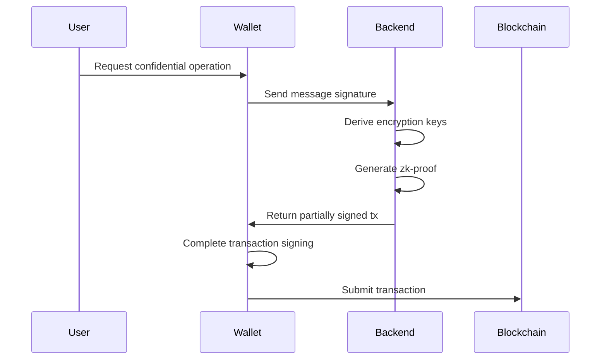
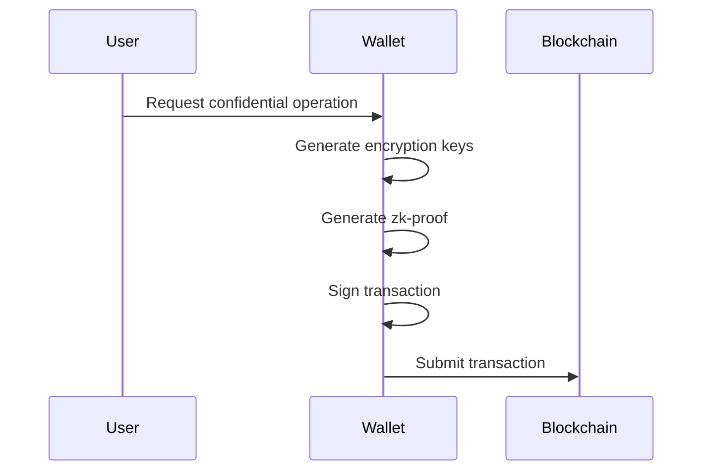

# Confidential Balances Token Extension Reference Implementation

A reference implementation demonstrating the **Confidential Balances features** from Solana Program Library's Token22. This project features a Rust backend (Axum) and a React frontend (Next.js).

## Implementation Types

### Trusted Implementation (This Project)
This is a **trusted** implementation that demonstrates UX possibilities for confidential balances operations on self-custodial wallets. The trust model works as follows:

- The backend receives the user's wallet message signature
- This signature serves as the seed for deriving ElGamal & AES encryption keys
- The backend handles zero-knowledge proof generation using these derived keys
- The backend returns partially signed transactions for the wallet to complete

**Suitable For:**
- Custodial wallet services
- Wallet-as-a-Service (WaaS) providers
- Trusted self-custodial wallets (read security considerations below)



### Trustless Implementation
A trustless implementation would:
- Generate and manage encryption keys entirely within the wallet
- Handle zero-knowledge proof generation internally
- Never expose encryption keys or their seeds to external services

**Current Status:**
- Rust-based wallets: Available now by implementing the [backend](backend) directly into the wallet client
- TypeScript wallets: Coming soon with the release of the [ElGamal Proof library](https://github.com/solana-program/zk-elgamal-proof/tree/main/clients/js-legacy#solanazk-elgamal-proof)



## ⚠️ Important Security Considerations

Trusted implementations require handling sensitive cryptographic operations on the backend. This introduces important security requirements:

1. **Key Derivation Security**
   - The backend derives encryption keys from user-provided seeds
   - These seeds must be transmitted securely and never stored
   - HTTPS is mandatory for all client-backend communication

2. **Backend Security Requirements**
   - Deploy in secure, restricted environments (e.g., Google Cloud Run, secure enclaves)
   - No caching or persistence of sensitive cryptographic material
   - Regular security audits and monitoring

3. **Trust Implications**
   - Users must trust the backend implementation
   - Backend has theoretical capability to decrypt user balances
   - Consider implementing additional audit mechanisms

## Live Demo
Check out the deployed version here: https://confidential-balances-microsite-peach.vercel.app

## Quick Start

### Backend

```bash
cd backend
cargo run
```

### Frontend

```bash
cd frontend
pnpm install
pnpm dev
```

Frontend runs at `http://localhost:3000`.

## Deployment

Update `frontend/.env`:

```env
NEXT_PUBLIC_BACKEND_API_ENDPOINT=https://your-hosted-backend-url.com
```

Ensure backend is accessible at this URL.

## Aditional Resources

- [Token extensions docs](https://solana.com/docs/tokens/extensions)
- [Confidential Balances Cookbook](https://github.com/solana-developers/Confidential-Balances-Sample/tree/main)
  - Additional Rust examples
  - Product guide